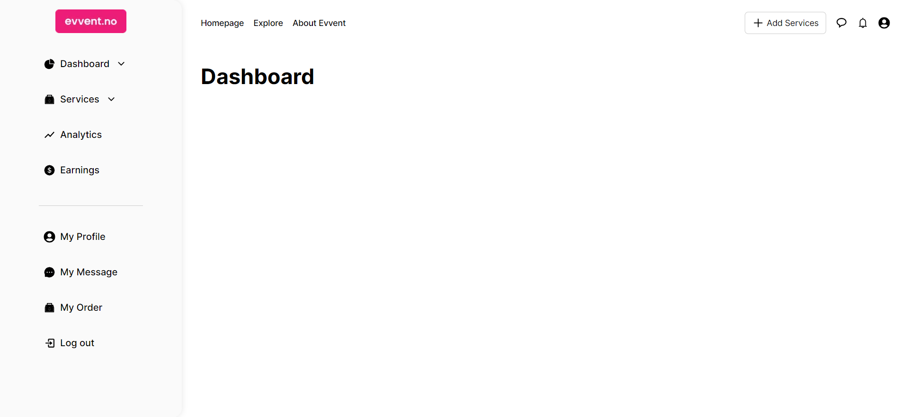

# Next Evvent Dashboard

Next Event Dashboard is a web application built using Next.js, React.js, and Tailwind CSS. It provides a user-friendly dashboard with various widgets and interactive components.

## Table of Contents
- [Introduction](#introduction)
- [Demo](#demo)
- [Technologies Used](#technologies-used)
- [Getting Started](#getting-started)
- [Folder Structure](#folder-structure)
- [Screenshots](#screenshots)
- [Contributing](#contributing)
- [License](#license)

## Introduction

Welcome to the Next Evvent Dashboard project! This dashboard application aims to recreate a given design with a focus on functionality, code quality, and user interface. It features components like Header, Sidebar, and interactive widgets to provide a seamless user experience.

## Demo



## Technologies Used

- [Next.js](https://nextjs.org/)
- [React.js](https://reactjs.org/)
- [Tailwind CSS](https://tailwindcss.com/)
- [Next-Auth](https://next-auth.js.org/) - For authentication
- [React Icons](https://react-icons.github.io/react-icons/) - For icons

## Getting Started

To get started with this project, follow these steps:

1. **Clone the repository:**
   ```bash
   git clone https://github.com/muhammadshiraz/next-evvent-dashboard.git
   cd next-evvent-dashboard

2. **Install dependencies:**

First, run the development server:

```bash
npm run dev
# or
yarn dev
# or
pnpm dev
# or
bun dev
```

Open [http://localhost:3000](http://localhost:3000) with your browser to see the result.

You can start editing the page by modifying `app/page.tsx`. The page auto-updates as you edit the file.

This project uses [`next/font`](https://nextjs.org/docs/basic-features/font-optimization) to automatically optimize and load Inter, a custom Google Font.

## Learn More

To learn more about Next.js, take a look at the following resources:

- [Next.js Documentation](https://nextjs.org/docs) - learn about Next.js features and API.
- [Learn Next.js](https://nextjs.org/learn) - an interactive Next.js tutorial.

You can check out [the Next.js GitHub repository](https://github.com/vercel/next.js/) - your feedback and contributions are welcome!

## Deploy on Vercel

The easiest way to deploy your Next.js app is to use the [Vercel Platform](https://vercel.com/new?utm_medium=default-template&filter=next.js&utm_source=create-next-app&utm_campaign=create-next-app-readme) from the creators of Next.js.

Check out our [Next.js deployment documentation](https://nextjs.org/docs/deployment) for more details.
